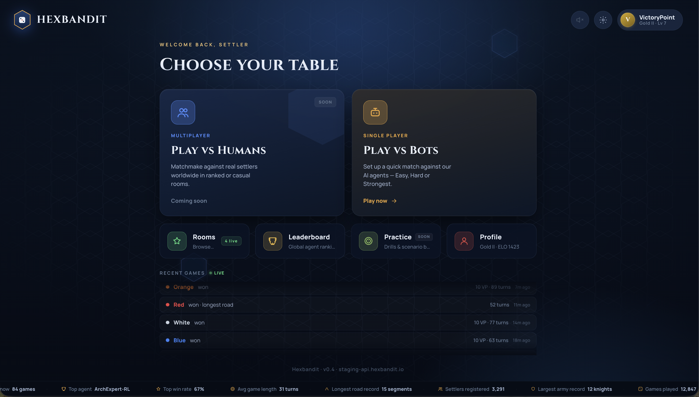
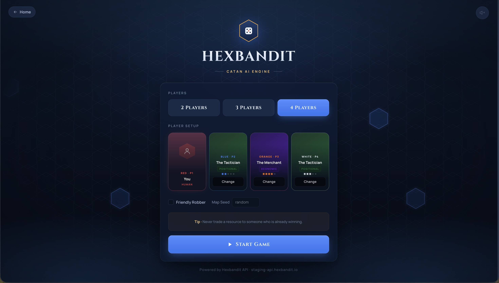
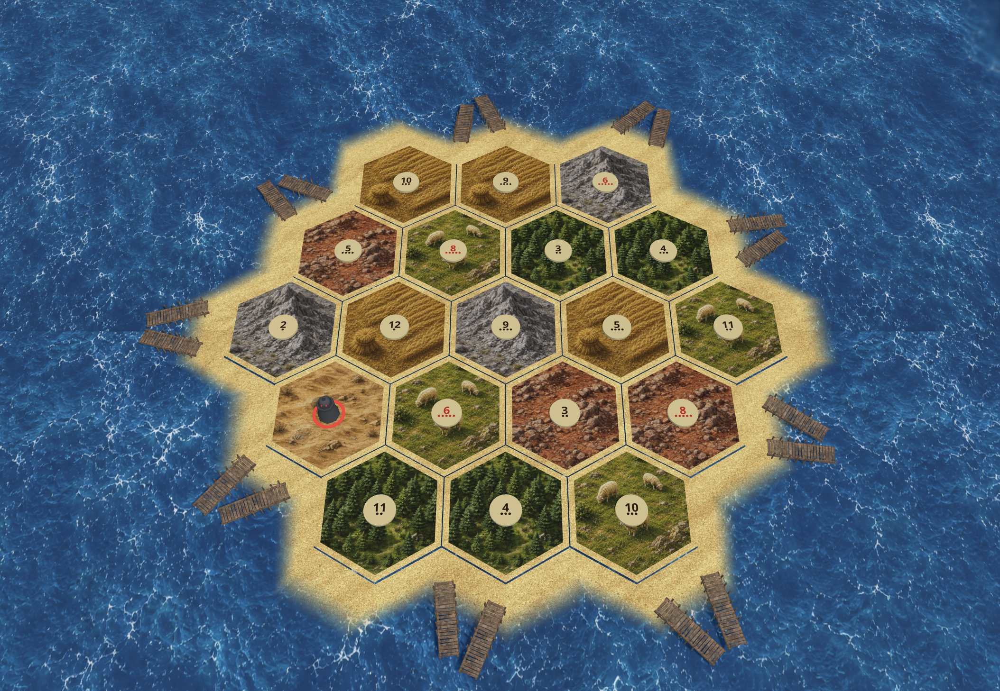

# Hexbandit Client

A production-quality web frontend for the [Hexbandit API](https://staging-api.hexbandit.io) — a Catan AI engine. Play against state-of-the-art reinforcement-learning bots, analyse every move, and watch games live via shareable spectator links.

---

## Features

### Gameplay
- **Play vs AI** — choose from multiple bot agents (Random, Tactician, Architect, Veteran, Expert NN) across 2–4 player games
- **Full Catan rules** — initial placement, dice rolls, resource collection, building, dev cards, trading (bank + player), robber, longest road, largest army
- **Interactive 3D board** — React Three Fiber hex grid with hover states, legal-move highlights, and animated emissive glows
- **Dev card hand** — hover fan-out, play knight / year of plenty / monopoly / road building inline

### Analysis & Replay
- **Win probability bar** — live eval bar showing each player's win% after every move, powered by the Hexbandit eval API
- **Replay mode** — scrub through every action in the game with first / prev / next / last controls
- **Move analysis** — per-step explanation of the action taken vs the best available move, with win-delta annotations on the board

### Post-Game
- **Final standings** — VP breakdown by category (settlements, cities, dev cards, largest army, longest road)
- **Game stats** — collapsible table showing roads built, knights played, dev cards played by type, longest road length, resources in final hand; enriched with trades made and robber counts when the action log is available

### Spectator & Sharing
- **Spectator links** — `/spectate/:gameId` shows a live read-only view of any in-progress or completed game, polling every 2.5 s with a pulsing **Live** badge
- **Share button** — one click copies the spectator URL to clipboard

### UX & Polish
- **Keyboard shortcuts** — `R` road · `S` settlement · `C` city · `K` knight · `T` trade · `Enter` roll/end turn · `Esc` cancel
- **Toast notifications** — top-right auto-dismissing toasts for errors, successes, and info messages
- **Persistent preferences** — mute state and master volume survive page refresh (Zustand persist)
- **Settings panel** — volume slider, mute toggle, fullscreen, and keyboard shortcut reference
- **Sound effects** — per-action SFX (dice roll, build, robber, your turn, achievement) with adjustable master volume
- **Responsive layout** — desktop, tablet, and mobile breakpoints with a swipeable drawer on mobile
- **Security** — opponent dev card details stripped client-side before storing in the Zustand store; perspective filtering passed to the API

---

## Tech Stack

| Layer | Library |
|---|---|
| UI framework | React 19 + TypeScript |
| Build | Vite |
| 3D rendering | React Three Fiber + Drei |
| Styling | TailwindCSS + CSS variables |
| State | Zustand (with persist middleware) |
| Server state | TanStack Query |
| Animation | Framer Motion |
| Routing | React Router v7 |

---

## Getting Started

### Prerequisites

- Node.js 18+
- npm 9+

### Install

```bash
git clone https://github.com/Rutvik2598/hexbandit-client.git
cd hexbandit-client
npm install
```

### Environment

Create a `.env.local` file in the project root:

```env
VITE_API_BASE_URL=https://staging-api.hexbandit.io
VITE_API_KEY=your_api_key_here
```

> The app will fall back to the public staging API and an empty key if these are not set.

### Run (development)

```bash
npm run dev
```

Open [http://localhost:5173](http://localhost:5173).

### Build (production)

```bash
npm run build        # type-check + bundle
npm run preview      # serve the production build locally
```

### Lint

```bash
npm run lint
```

---

## Project Structure

```
src/
├── app/              # Providers, router setup
├── pages/
│   ├── home/         # Landing page & auth
│   ├── lobby/        # Game setup (player count, agent selection)
│   ├── game/         # Main game page (GamePage.tsx)
│   └── spectator/    # Read-only spectator view
├── features/
│   ├── game-board/   # 3D board (R3F canvas, tiles, roads, vertices)
│   ├── action-panel/ # Dice tray, roll/end-turn, build buttons
│   ├── player-panel/ # Per-player card with VP, resources, pwin
│   ├── resource-hand/# Dev card stack + resource cards
│   ├── eval-bar/     # Win probability bar
│   ├── analysis-panel# Move analysis + replay annotations
│   ├── replay-controls/ # Scrubber + transport buttons
│   ├── game-log/     # Scrollable action log
│   ├── game-over/    # Victory screen + post-game stats
│   ├── trade/        # Maritime trade modal + player trade modal
│   └── settings/     # Settings panel (volume, fullscreen, shortcuts)
├── entities/         # Domain types and coordinate helpers
├── services/api/     # gamesApi, movesApi, agentsApi, HTTP client
├── store/            # Zustand stores (game, ui, interaction, toast)
├── shared/
│   ├── components/   # Icon, ResourceIcon, FlyLayer, ToastContainer, …
│   ├── hooks/        # useGameLoop, useKeyboardShortcuts, useSound, …
│   ├── utils/        # actionLog, sanitizeGameState, computeGameStats, …
│   └── types/        # game.ts, api.ts domain models
└── styles/           # Global CSS variables and animations
```

---

## Routes

| Path | Description |
|---|---|
| `/` | Home — login / guest access, recent games, global stats |
| `/lobby` | Game setup — player count, agent selection, map seed |
| `/game` | Active game session |
| `/spectate/:gameId` | Read-only spectator view (shareable link) |

---

## Keyboard Shortcuts

| Key | Action |
|---|---|
| `Enter` | Roll dice · or · End turn |
| `R` | Toggle Build Road mode |
| `S` | Toggle Build Settlement mode |
| `C` | Toggle Build City mode |
| `K` | Play Knight card |
| `T` | Open player trade offer |
| `Esc` | Cancel mode / close modal |

---

## Screenshots

### Home



### Game Setup



### Active Game



---

## License

Private — all rights reserved.
