# Hexbandit Client — Architecture & Implementation Report

> Stack: React 19 · TypeScript 6 · Vite 8 · React Three Fiber · Zustand · Framer Motion · Tailwind CSS 4  
> Tests: 209 unit tests · ~70% coverage · Vitest · CI via GitHub Actions · Codecov

---

## Table of Contents

1. [Project Overview](#1-project-overview)
2. [Architecture & Design Decisions](#2-architecture--design-decisions)
3. [Domain Model](#3-domain-model)
4. [Data Flow](#4-data-flow)
5. [UI Screenshots](#5-ui-screenshots)
6. [Responsive Design](#6-responsive-design)
7. [Static & Mocked Sections](#7-static--mocked-sections)
8. [Directory Structure](#8-directory-structure)
9. [Deployment](#9-deployment)
10. [State Management](#10-state-management)
11. [Core Game Loop](#11-core-game-loop)
12. [API Layer](#12-api-layer)
13. [Board Rendering](#13-board-rendering)
14. [Interaction Model](#14-interaction-model)
15. [Replay & Analysis](#15-replay--analysis)
16. [Win Probability & Evaluation](#16-win-probability--evaluation)
17. [Testing](#17-testing)
18. [Known Gaps](#18-known-gaps)
19. [Recommendations for Future Work](#19-recommendations-for-future-work)

---

## 1. Project Overview

Browser client for the Hexbandit API — a Catan AI engine. The frontend owns rendering, interaction, and visualization; the backend owns game logic, move legality, bot decisions, and evaluation.

**User flows:** configure a 2–4 player game vs. bots → play on an interactive 3D board → view live win-probability after every move → replay any game move-by-move with per-step AI analysis → share a live spectator link → post-game standings and stats breakdown.

**Spectator mode:** any active game can be watched in real-time via `/spectate/:gameId`. The spectator view polls `GET /games/{id}/state` every 2.5 s, renders the full board and player panels in read-only mode (no actions, no interaction), and shows a pulsing **Live** badge while the game is in progress. When the game ends it auto-loads the recording and enters replay mode. The share button copies the spectator URL to clipboard — anyone with the link can watch without an account.

---

## 2. Architecture & Design Decisions

### React Three Fiber for the board

The board uses R3F (React Three Fiber) rather than SVG or Canvas 2D. Key reasons:
- **True 3D perspective** — camera angle, lighting, and depth are core to the aesthetic; flat SVG can't replicate this
- **Raycasting interaction** — R3F pointer events on 3D meshes are cleaner than SVG hit areas on a hex grid, especially with overlapping elements (roads, settlements, number tokens)
- **Custom shaders** — the beach border uses a GLSL `smoothstep` fade that only makes sense in a WebGL context
- **Idiomatic React** — R3F keeps Three.js objects as React components with props and lifecycle, avoiding a parallel imperative scene graph

### Zustand for state management

Chosen over Redux/Context for two reasons:
1. **`getState()` outside React** — `useGameLoop` manages async API calls from within `useCallback` closures. It needs to read store state *without* re-subscribing to React's render cycle on every async tick. Zustand's `useGameStore.getState()` makes this trivial; Redux `dispatch` would need more indirection.
2. **No boilerplate** — four small, focused stores with no action creators, reducers, or selectors overhead.

### Four-store separation

| Store | What it owns | Why separated |
|-------|-------------|---------------|
| `gameStore` | Server state, pwin, log, replay | Single source of truth; all async side-effects write here |
| `interactionStore` | Board mode, hover, preview | Reset on every state refresh so it never goes stale; completely independent of server state |
| `uiStore` | Sidebar, modals, sound prefs | User preferences persisted to localStorage; deliberately isolated from game logic |
| `toastStore` | Notification queue | Callable from anywhere, including async callbacks outside React tree |

### Polling over WebSockets

The backend uses a request/poll contract for AI moves: `POST /moves/request` → get `request_id` → `GET /moves/{id}` until complete. Matching this on the client avoids a WebSocket layer entirely. The polling loop is budget-aware (adapts interval based on AI think time), self-cancelling on timeout, and reconnect-safe (just retry the poll). WebSockets would add complexity without benefit given the existing API contract.

### Feature-based folder structure

Features (`action-panel/`, `game-board/`, `trade/`, …) co-locate their components. Shared concerns live in `shared/` with explicit imports. This scales better than a flat `components/` directory — each feature can be understood and modified as a self-contained unit.

### TanStack Query scope

Installed but intentionally not used for game state. The polling loop needs fine-grained control: budget tracking, progress callbacks, cancellation on timeout, and adaptive intervals based on AI progress. TanStack Query's abstractions don't expose this level of control. TQ is used only for the lobby's agent list and other simple one-shot GETs.

### SVG for win-probability chart

`PwinChart` uses SVG rather than Canvas or a charting library. The chart has a small, fixed number of data points (one per frame with evaluation data) and needs precise interactive cursor behaviour. Raw SVG paths give full control over styling and animation without a third-party dependency.

---

## 3. Domain Model

The core Catan entities and how they map to the codebase:

```
GameState (server snapshot)
├── Board
│   ├── tiles: Record<CubeKey, { resource, number }>     ← 19 hex tiles
│   ├── buildings: Record<NodeKey, { color, type }>       ← settlements & cities
│   ├── roads: Record<EdgeKey, PlayerColor>               ← placed roads
│   ├── ports: PortEntry[]                                ← 2:1 / 3:1 port positions
│   └── robber_coordinate: [x, y, z]
├── players: Player[]
│   ├── resources: { wood, brick, sheep, wheat, ore }     ← freqdeck (counts)
│   ├── dev_cards_played / dev_cards_private              ← by type
│   ├── settlements, cities, roads_built                  ← board counts
│   └── victory_points, knights_played, longest_road_length
├── game_phase: GamePhase                                 ← INITIAL_BUILD | PLAY_TURN | DISCARDING | …
├── playable_actions: PlayableAction[]                    ← { action_type, value } — legal moves
└── action_log: ActionLogEvent[]                          ← append-only game history

Coordinate systems (entities/board/coordinates.ts)
├── Cube coords [x, y, z] where x+y+z=0 — tiles & robber
├── Fractional cube coords — 54 node (vertex) positions
├── EdgeKey "(min, max)" — canonical road identifier
└── World coords (XZ plane) — R3F scene positions
```

**Key type:** `PlayableAction = { action_type: ActionType, value: unknown }` — the single unit of interaction between frontend and backend. Every button click, board tap, and keyboard shortcut resolves to one of these before being sent to the API.

---

## 4. Data Flow

### Human turn — action submission

```
 User input (click board / button / keyboard)
          │
          ▼
 interactionStore.mode            ← BUILD_ROAD, BUILD_SETTLEMENT, etc.
 determines which action to form
          │
          ▼
 GamePage.handleAction(PlayableAction)
          │
          ▼
 useGameLoop.submitAction()
   humanInFlight = true           ← blocks re-entry
   clearActionsPwin()             ← stale eval cleared immediately
          │
     POST /games/{id}/moves
          │
          ▼
 useGameLoop.refreshState()
     GET /games/{id}/state        ← incremental action log via action_log_start_index
          │
          ▼
 gameStore.setGameState(newState)
 processActionLog() → addLog · setResourceGains · setLastRollDice
 interactionStore.resetInteraction()
          │
    ┌─────┴──────────────────────────────────┐
    ▼                                        ▼
 Board re-renders                   evaluatePosition()
 (R3F reads gameStore)                POST /moves/evaluate
 PlayerPanel, ActionPanel,            poll → updatePwin() [EMA]
 EvalBar all update reactively        EvalBar · PwinChart update
```

---

### AI turn — move request & polling

```
 autoAdvanceAI() / doAiMove()
   aiInFlight = true              ← blocks concurrent AI moves
   setThinking({ phase: 'submitting' })
          │
     POST /moves/request          ← returns { request_id }
          │
          ▼
 pollUntilComplete(request_id)
   ┌─ GET /moves/{id} every 500 ms ──────────────────────────────┐
   │   progress > 80%? → 200 ms intervals                        │
   │   5xx error?      → retry up to 5× with 1 s backoff         │
   │   timeout?        → DELETE /moves/{id} → surface error      │
   │   setThinking({ phase: 'thinking', progress, message })     │
   └─────────────────────────────────────────────────────────────┘
          │  status === 'complete'
          ▼
 clearThinking()
          │
          ▼
 refreshState()                   ← same path as human turn above
          │
          ▼
 isCurrentPlayerHuman?
   YES → evaluatePosition()       ← POST /moves/evaluate → poll → updatePwin()
   NO  → doAiMove() again         ← loop continues until human turn or winner
```

---

## 5. UI Screenshots

| | |
|---|---|
| **Home** — mode select, quick-access panels, live recent games | **Lobby** — player count, bot persona cards, rule variants |
|  |  |
| **Active Game (desktop)** — 3D board, action panel, eval bar, player cards + log | **Mobile** — full-screen board, bottom drawer (Menu / Trade / Players) |
|  | 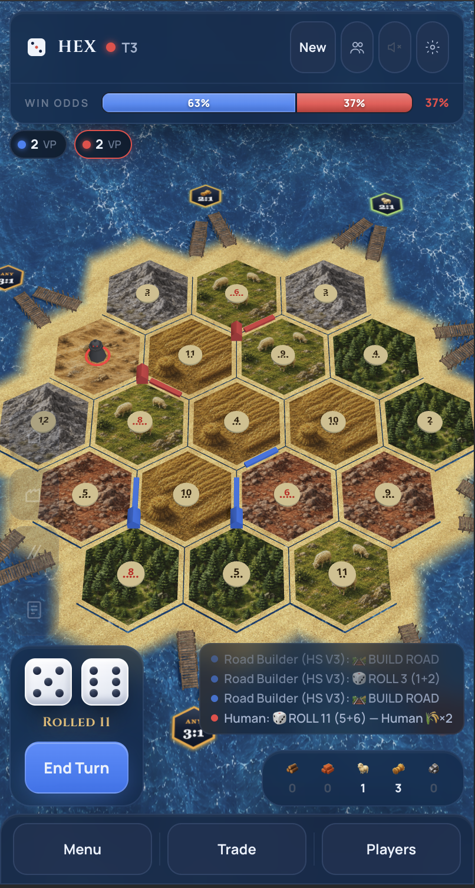 |
| **Analysis — Road suggestion** — best moves ranked by win-delta, previewed on board | **Analysis — Robber placement** — candidate tiles highlighted on board |
| 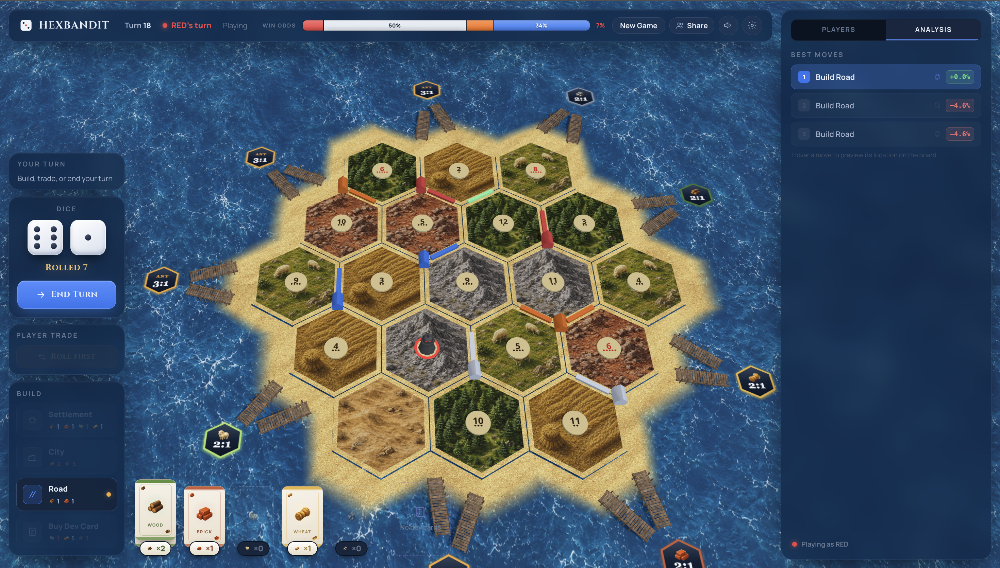 | 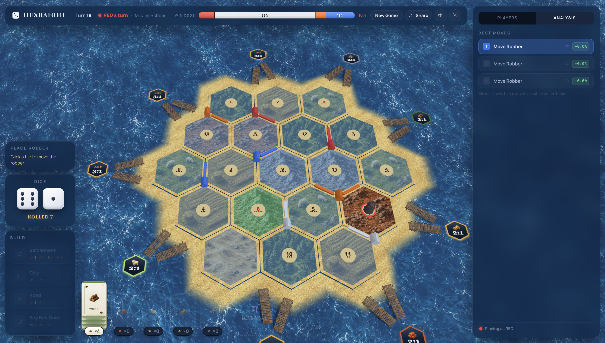 |
| **Trade — Incoming offer** — Accept / Reject with give/get breakdown | **Trade — Choose partner** — pick which acceptee to confirm with |
| 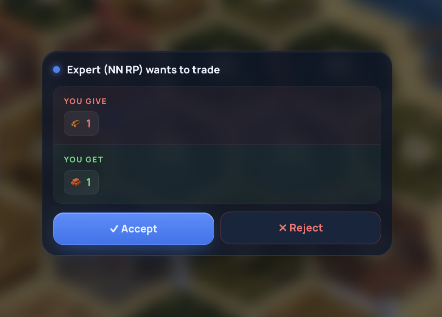 | 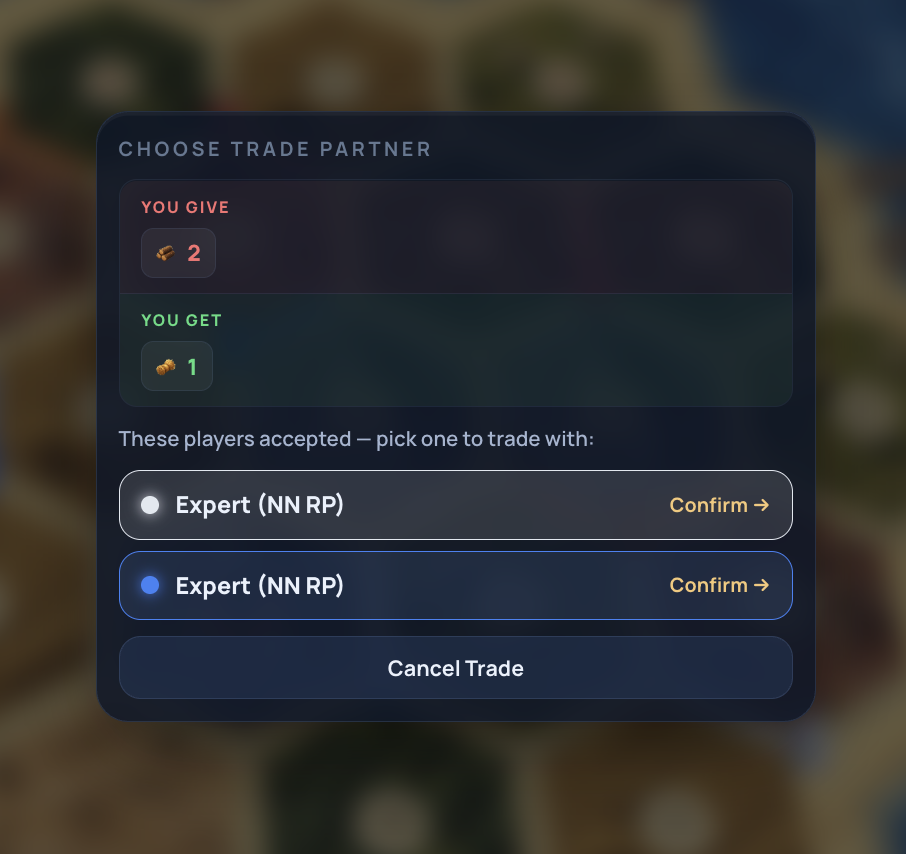 |
| **Discard panel** — +/− per resource, live "N left" counter | **Settings** — volume, fullscreen, keyboard shortcut reference |
| 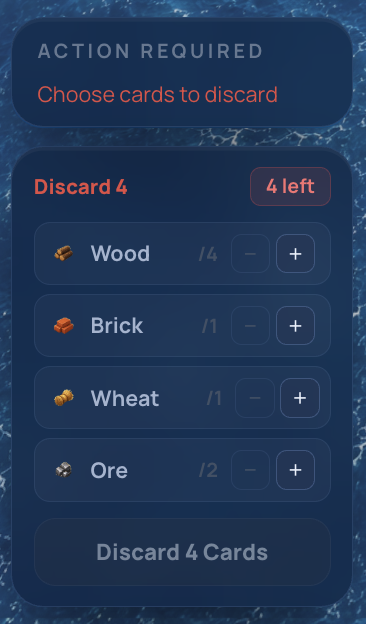 | 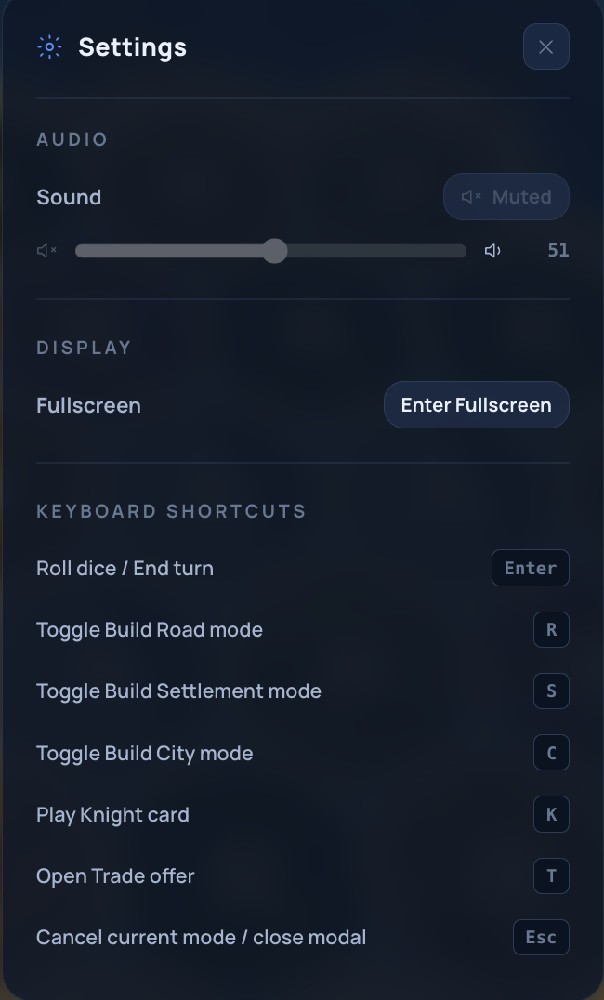 |
| **Game Over** — winner, VP breakdown, Replay / Rematch CTAs | **Post-game Stats** — per-player roads, knights, dev cards, final hand |
| 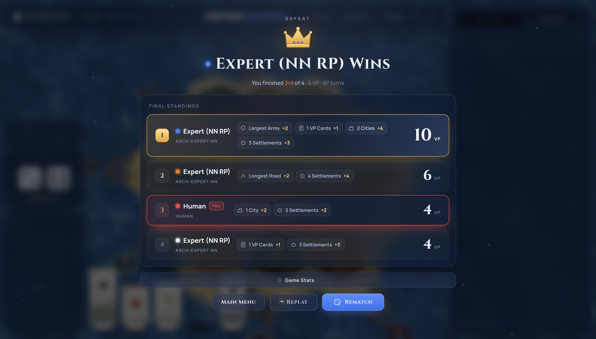 | 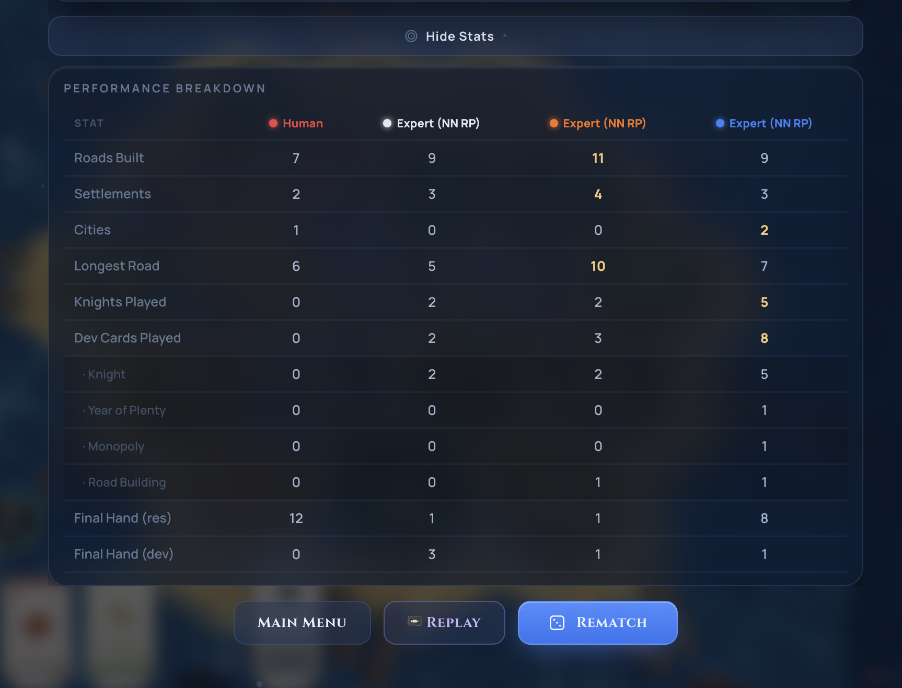 |

---

## 6. Responsive Design

`useBreakpoint()` classifies window width into three tiers:

| Breakpoint | Width | Layout |
|------------|-------|--------|
| `mobile` | < 768 px | Full-screen board; bottom nav bar (Menu / Trade / Players); drawer-based action panel |
| `tablet` | 768–1023 px | Board + narrow sidebar (260 px); compact action panel |
| `desktop` | ≥ 1024 px | Board + full sidebar (344 px); floating trade modals; full eval bar in header |

Mobile-specific behaviours:
- Drawer auto-opens on phase changes (discard required, trade response pending)
- Eval bar collapses to a thin colour-coded strip
- Touch targets on board nodes/edges are padded beyond geometry size
- `FlyLayer` resource-gain animations suppressed while drawer is open

---

## 7. Static & Mocked Sections

The following sections are UI-complete but backed by hardcoded mock data.

| Section | Screenshot | Needs to go live |
|---------|------------|-----------------|
| **Game Rooms** | 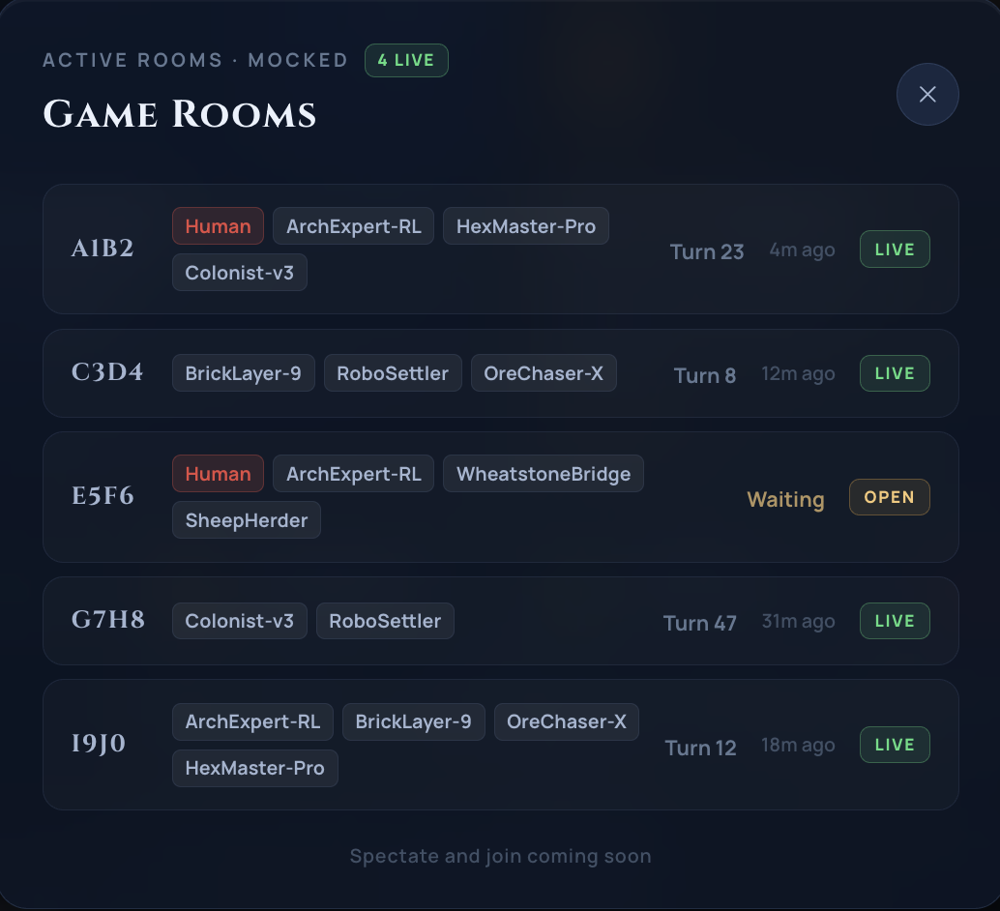 | `/rooms` API + WebSocket/polling for turn counts + spectate-join flow |
| **Leaderboard** | 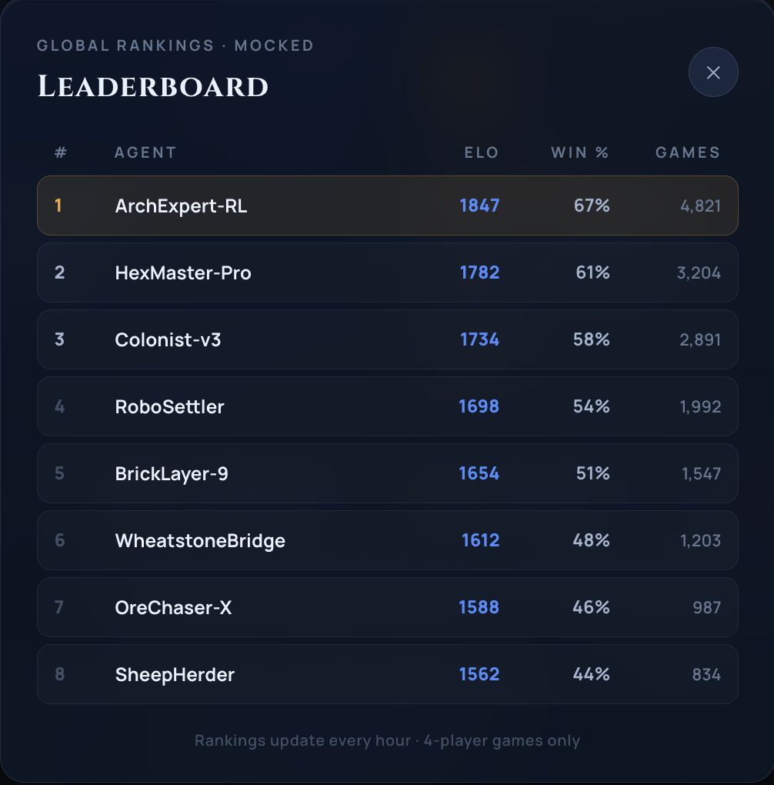 | `/leaderboard` API with ELO aggregates — UI is complete |
| **Profile** | 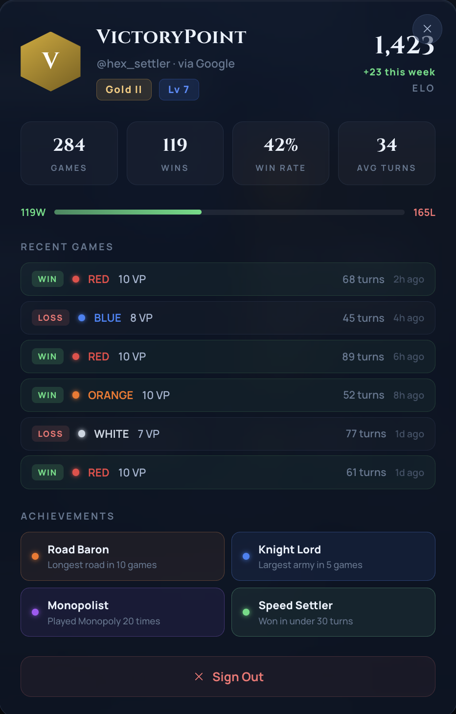 | `/users/me` endpoint + real auth + server-side achievements |
| **Authentication** | *(modal in home)* | Real OAuth provider (Auth0/Supabase/Firebase) — UI flow is complete |

---

## 8. Directory Structure

```
src/
├── pages/         home/ · lobby/ · game/ (GamePage 1 453 ln) · spectator/
├── features/      action-panel/ · analysis-panel/ · eval-bar/ · game-board/
│                  game-over/ · player-panel/ · replay-controls/ · trade/ · …
├── entities/      board/coordinates.ts   ← cube coords, adjacency, world positions
├── services/api/  client.ts · gamesApi.ts · movesApi.ts · agentsApi.ts
├── store/         gameStore · interactionStore · uiStore · authStore · toastStore
└── shared/        components/ · hooks/ · utils/ · constants/ · types/
```

---

## 9. Deployment

The app is a Vite SPA deployed to **Vercel**.

**`vercel.json`** (project root) is required for client-side routing to work in production:

```json
{ "rewrites": [{ "source": "/(.*)", "destination": "/index.html" }] }
```

Without this, Vercel's static file server returns 404 for any deep-linked route (e.g. `/spectate/:gameId`, `/lobby`) because those paths have no corresponding file — they are React Router routes that only resolve once `index.html` is loaded. Vite's dev server handles this automatically, which is why all routes work on localhost.

**Environment variables** required in Vercel project settings:

| Variable | Purpose |
|----------|---------|
| `VITE_API_BASE_URL` | Backend API base URL |
| `VITE_API_KEY` | API authentication key |

Both fall back to defaults if unset (`https://staging-api.hexbandit.io` and empty key respectively), but the app will fail API auth in production without the correct values.

---

## 10. State Management

Four Zustand stores:

| Store | Persisted | Responsibility |
|-------|-----------|----------------|
| `gameStore` | No | Game state, thinking indicator, pwin, log, replay, auto-play |
| `interactionStore` | No | Board mode, hover, suggestion preview highlight |
| `uiStore` | Yes (`muted`, `soundVolume`) | Sidebar tab, modal visibility, sound prefs |
| `authStore` | Yes (user object) | Session identity |
| `toastStore` | No | Notification queue (max 5, 4 s / 6 s for errors) |

**Notable `gameStore` details:**
- `updatePwin()` applies EMA smoothing (`PWIN_SMOOTH_ALPHA = 0.4`) to reduce eval jitter; raw value kept separately
- `addLog()` slices to last 200 entries to prevent memory growth
- `getGameState()` passes `action_log_start_index` for incremental log fetching

---

## 11. Core Game Loop

`useGameLoop` (`src/shared/hooks/useGameLoop.ts`) — consumed only by `GamePage`.

```
GamePage mounts
    ├─ refreshState()              GET /games/{id}/state
    │       └─ processActionLog()  → addLog · setResourceGains · setLastRollDice
    ├─ human turn?  YES → evaluatePosition()   POST /moves/evaluate → poll → updatePwin()
    │               NO  → autoAdvanceAI()  ──► doAiMove() loop
    └─ human action
            └─ submitAction()
                    ├─ POST /games/{id}/moves  →  refreshState()  →  evaluatePosition()
                    └─ still AI turn?  →  autoAdvanceAI()
```

**Concurrency:** `aiInFlight` / `humanInFlight` refs block duplicate requests. Auto-advance loops carry a `runId` to detect and exit stale iterations.

| Callback | Purpose |
|----------|---------|
| `refreshState()` | Fetch latest game state |
| `submitAction(action)` | Submit a human move |
| `evaluatePosition()` | Request pwin evaluation |
| `autoAdvanceAI()` | Drive AI turns until human or winner |
| `startAutoPlay()` / `stopAutoPlay()` | AI vs AI watch mode |
| `enterReplay()` / `exitReplay()` | Load recording, enter scrub mode |
| `cleanup()` | DELETE game on unmount |

---

## 12. API Layer

**Client (`client.ts`):** thin `fetch` wrapper — `X-API-Key` auth header, `ApiError` with status/path/detail, auto-JSON, 204 → undefined, friendly 502/503/504 messages.

**Games API:**

| Method | Endpoint | Notes |
|--------|----------|-------|
| `createGame()` | `POST /games/` | Normalises `id` vs `game_id` inconsistency |
| `getGameState()` | `GET /games/{id}/state` | Supports `perspectiveColor` + `actionLogStart` |
| `submitMove()` | `POST /games/{id}/moves` | Returns updated `GameState` |
| `deleteGame()` | `DELETE /games/{id}` | Called on page unmount |
| `getRecording()` | `GET /games/{id}/recording` | Returns `RecordingFrame[]` |

**Polling (`pollUntilComplete`):** submit → get `request_id` → poll until `complete`.

| Constant | Value | Purpose |
|----------|-------|---------|
| `POLL_INTERVAL_MS` | 500 ms | Base cadence |
| `POLL_FAST_INTERVAL_MS` | 200 ms | When progress > 80% |
| `POLL_TIMEOUT_MS` | 90 s | Hard timeout (extended by `think_budget × 3`) |
| `POLL_TRANSIENT_MAX` | 5 | Retries on 5xx with 1 s backoff |

Timeout cancels the request via `DELETE /moves/{requestId}`.

---

## 13. Board Rendering

**Coordinate system:** cube coords `[x, y, z]` where `x+y+z=0`. 19 tiles · 54 nodes · 72 edges. Adjacency map built at module load. `tileToWorld3D()` / `nodeToWorld3D()` map to XZ plane (`HEX_RADIUS_3D = 1.2`).

**Scene:**
```
<Canvas>
  <Ocean />          ← water texture, 4× UV repeat
  <BeachBorder />    ← custom ring geometry + GLSL smoothstep fade at tile edge
  <HexTile3D />      ← ExtrudeGeometry + resource texture + number token (×19)
  <RoadEdge3D />     ← BoxGeometry coloured by player
  <VertexNode3D />   ← settlement (box+pyramid) or city (tower)
  <Port3D />         ← port direction indicator
  <Robber3D />
  <PlacementHint />  ← pulsing ring on legal placement nodes
</Canvas>
```

R3F pointer events (`onPointerEnter`, `onPointerLeave`, `onClick`) on each mesh update `interactionStore` and fire `onAction` on click.

---

## 14. Interaction Model

| Mode | Trigger | Effect |
|------|---------|--------|
| `IDLE` | Default / after action | No highlights |
| `BUILD_ROAD` | R / Road button | Legal edges glow → click submits |
| `BUILD_SETTLEMENT` | S / Settlement button | Legal nodes glow → click submits |
| `BUILD_CITY` | C / City button | Upgradeable nodes glow → click submits |
| `MOVE_ROBBER` | Auto on MOVING_ROBBER phase | All tiles highlight → click submits |
| `DISCARD` | Auto on DISCARDING phase | Discard panel shown |
| `YEAR_OF_PLENTY` / `MONOPOLY` | Card play | Resource picker modal |
| `MARITIME_TRADE` / `OFFER_TRADE` | T / Trade button | Trade modal |

Analysis suggestions set `previewNode / previewEdge / previewTile` independently of mode to preview board locations on hover. Keyboard shortcuts ignored inside input/textarea/contenteditable.

---

## 15. Replay & Analysis

- `getRecording()` returns `RecordingFrame[]` — each frame has `turn`, `action`, `state`, `evaluate`
- `useReplayJump(step)` applies `frame.state` to the store (re-renders board) and fetches move analysis from `POST /moves/analyze` if the action was taken by a human player
- `PwinChart` renders per-player SVG pwin curves; clicking a point jumps the replay to that frame

---

## 16. Win Probability & Evaluation

Evaluation triggers: after every human move (if step advanced) or on board load (if human turn). Skipped during `INITIAL_BUILD` and after a winner is set.

- `evaluatingRef` prevents concurrent requests; `lastEvaluatedStep` deduplicates
- Smoothed `lastPwin` (EMA) drives `EvalBar` width animations (0.5 s transition)
- `lastActionsPwin` cleared on move submit, repopulated after next evaluation

---

## 17. Testing

**Coverage: ~70% · 209 tests · Vitest 4 · Node environment · `@vitest/coverage-v8` · Codecov**

| File | Coverage |
|------|----------|
| `coordinates.ts` | ~95% |
| `actionLog.ts` | ~83% |
| `computeGameStats.ts` | 100% stmt / 79% branch |
| `formatSuggestionLabel.ts` | ~98% |
| `parseSuggestionHighlight.ts` | 100% |
| `interactionStore` | ~100% |
| `toastStore` / `authStore` | 100% |
| `uiStore` | ~91% |
| `gameStore` | 0% — highest priority gap |
| API services, React components | 0% — E2E / component tests needed |

**Not unit tested by design:** R3F components (need WebGL), `textureUtils.ts` (needs GPU), `useGameLoop` (async + 6 API deps — better covered by E2E), API service layer (thin pass-throughs).

---

## 18. Known Gaps

- **`GamePage.tsx` (1 453 lines)** — handles layout, init, phase detection, animations, modals, and shortcuts all in one file
- **`gameStore.ts` untested** — largest store, zero coverage; contains pwin smoothing and log capping logic
- **No E2E tests** — no automated browser-level validation of the full game flow
- **No feature-level error boundaries** — a board or panel crash takes down the whole game session
- **Mobile board performance** — 19 separate `HexTile3D` meshes instead of `InstancedMesh`; `PerformanceMonitor` not wired
- **No offline / reconnect handling** — network drop stalls the UI with just a toast
- **`TradeModal` / `OfferTradeModal` duplication** — resource picker UI copy-pasted between both modals
- **No bundle splitting** — single 1.7 MB chunk (489 KB gzip); Three.js loaded on every page
- **Mocked sections** — Rooms, Leaderboard, Profile, and Auth are UI-complete but not connected to real APIs

---

## 19. Recommendations for Future Work

### High impact, low effort
1. **Test `gameStore.ts`** — pure state transforms (pwin smoothing, log capping); pushes coverage to ~85%
2. **Increase coverage to 85%+** — missing branches in `actionLog.ts` (lines 73, 103, 110, 117) and `computeGameStats.ts`
3. **Feature-level `ErrorBoundary`** — wrap `GameBoard3D`, `ActionPanel`, `AnalysisPanel` individually
4. **Extract `ResourcePicker`** — `TradeModal` and `OfferTradeModal` duplicate the same resource selection UI
5. **Split `GamePage.tsx`** — 1 453 lines; extract `useGameInitialiser`, `usePhaseRouter`, `useAchievementTracker`

### High impact, medium effort
6. **UI component tests** (`@testing-library/react`) — `ActionPanel`, `PlayerCard`, `EvalBar`, `TradeModal`
7. **Playwright E2E tests** — golden path: lobby → game → placement → AI turn → human roll → build → winner
8. **Bundle splitting** — `React.lazy()` on `GameBoard3D`; Three.js not needed on home/lobby; ~40–50% JS savings
9. **`InstancedMesh` for hex tiles** — replace 19 separate meshes with one draw call; wire `PerformanceMonitor`

### Medium impact, medium effort
10. **Real auth** — replace `mockLogin()` with OAuth (Auth0 / Supabase / Firebase); UI already complete
11. **Live Rooms & Leaderboard** — connect to `/rooms` and `/leaderboard` APIs; UI already complete
12. **Offline / reconnect** — `useNetworkReconnect` hook on `window.online` → `refreshState()` + persistent banner
13. **Live Profile** — wire to `/users/me` for real stats, game history, achievements

### Low effort, low impact (polish)
14. **Remove `createGame` normalisation shim** — once API consistently returns `game_id`
15. **Comment `PWIN_SMOOTH_ALPHA`** — document the 0.4 tradeoff for future tuning
